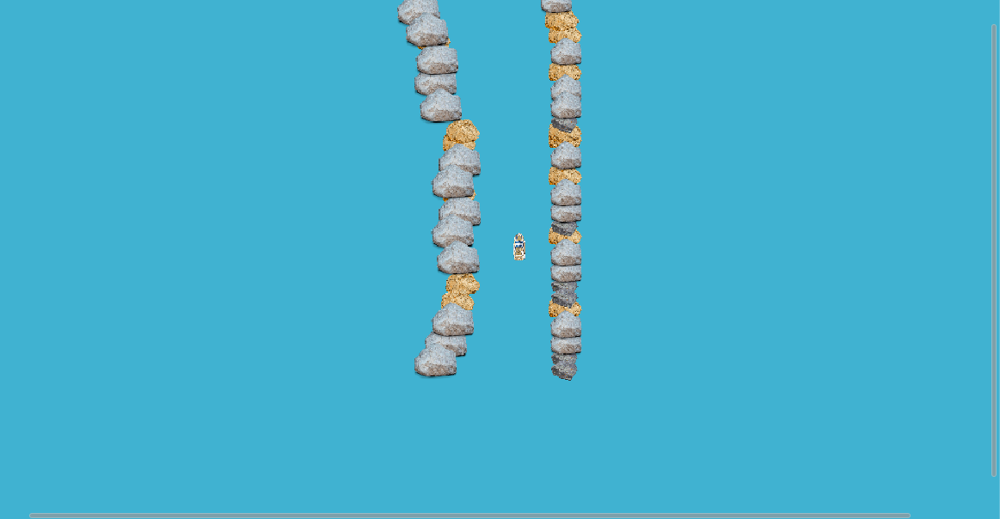

# ShipEnv_RL
This repository provieds a Reinforcement Learning in Unity using ML-Agent. 

## Dependencies
* [Unity 2018.3.9f]
* [Unity ML-Agent Toolkit(Beta)] (https://github.com/Unity-Technologies/ml-agents)
